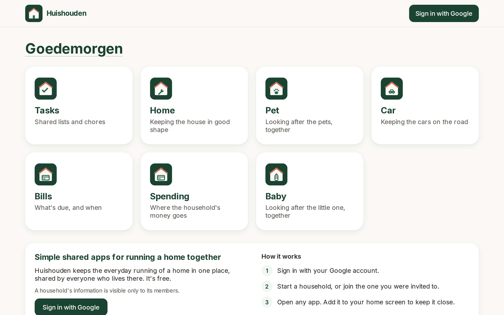
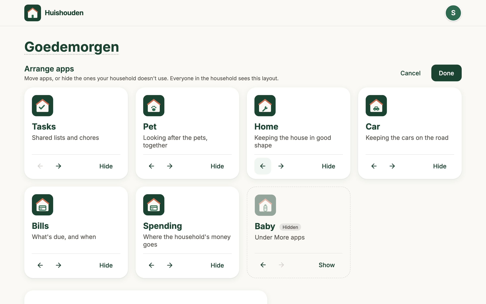

# Huishouden

The household's front door: one installable PWA that opens the other household apps.



_Screenshot of the live site, refreshed by CI after each deploy._

| App | URL | Repo |
|---|---|---|
| Huishouden (this) | https://huishouden-piekstra.web.app | huishouden/portal |
| Spending | https://huishouden-spending.web.app | huishouden/spending |
| Tasks & Groceries | https://huishouden-tasks.web.app | piekstra/huishouden-tasks |

Every app follows [STANDARDS.md](STANDARDS.md). Each app is its own repo and its own Firebase Hosting site in project `huishouden-piekstra`.
Every app is listed once, in `apps.json`: the tiles come from it, and `infra/apps.conf` reads it to
provision hosting. Its order is the default tile order: simple everyday apps first, Spending (which
needs setup) after them, Baby (not for every household) last.

## Tiles

A household's members can arrange its tiles (Arrange, under the tiles): move apps earlier or later,
or hide them. The layout is saved in `households/{id}/settings/portal` (`order` and `hidden`, app
repo names; rules in huishouden/rules), so every member sees it on every device. Apps the layout
doesn't mention, such as apps added later, follow the ordered ones in registry order. Hidden apps
stay one tap away under More apps. Signed-out visitors see the default.



## Develop

```sh
bun install
bun run dev      # http://localhost:3001
bun run lint && bun run test && bun run build
bun run icons    # after editing public/icon.svg
```

## Deploy

Merges to `main` deploy through `.github/workflows/ci.yml` using Workload Identity
Federation (repo variables `GCP_WIF_PROVIDER`, `GCP_DEPLOY_SA`). Pull requests only build.
